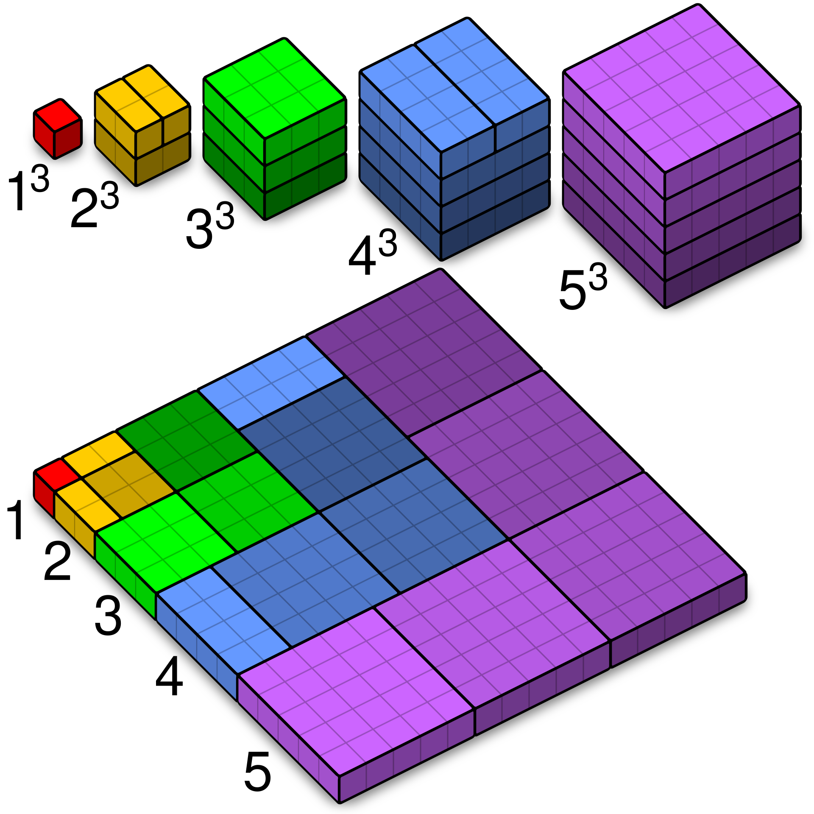

OK, der Titel mag irritieren: leider deutet im Moment wenig darauf hin, dass 2025 ein wirklich gutes Jahr wird: angefangen bei meiner Krankenkasse, die von mir fast 15% mehr haben möchte als noch 2024, über den designierten Präsidenten der USA bis hin zur Bundestagswahl im Februar. Aber es soll hier weder um Politik noch um meine Krankenkasse gehen, sondern um das Jahr 2025 bzw. einfach um die Zahl 2025 - aber was macht 2025 zu einer interessanten Zahl?

* 2025 ist eine Quadratzahl, nämlich $2025 = 45^2$. Mit an Sicherheit grenzender Wahrscheinlichkeit ist das die einzige quadratische Jahreszahl für die meisten von uns, war die letzte doch $1936$ und die nächste wird erst wieder $2116$ sein.

* Als eine von nur drei vierstelligen Jahreszahlen hat 2025 die Eigenschaft, dass man sie in der Form $abcd = (ab+cd)^2$ schreiben kann, wobei $a, b, c$ und $d$ jeweils Ziffern sind und $a \neq 0$ ist: $(20+25)^2 = 2025$. Die beiden anderen vierstelligen Jahreszahlen, die diese Eigenschaft haben sind $3025= (30 + 25)^2$ und $9801 = (98+01)^2$.

* 2025 ist aber nicht einfach nur irgendeine Quadratzahl. 45 kann als die Summe der Zahlen von 1 bis 9 geschrieben werden und damit ist 

\begin{align*}
2025 = 45^2 = (1+2+3+4+5+6+7+8+9)^2. 
\end{align*}

Das eigentlich Schöne daran ist aber, dass man auch schreiben kann

\begin{align*}
2025 = 1^3 + 2^3 + 3^3 + 4^3 + 5^3 + 6^3 + 7^3 + 8^3 + 9^3.
\end{align*}

Das heißt $2025$ ist nicht nur das Quadrat der Summe der ersten neun natürlichen Zahlen, sondern auch noch die Summe deren Kuben!

::: {.columns}
::: {.column width="68%"}

Diese Eigenschaft gilt aber nicht nur für 2025, sondern allgemeiner und man kann zum Beispiel mit Hilfe der vollständigen Induktion zeigen, dass das Quadrat der Summe der ersten $n$ natürlchen Zahlen gleich der Summe deren Kuben ist. Rechts ist eine geometrische Veranschaulichung dessen.

\begin{align*}
\left(\sum_{i=1}^n i\right)^2 = \sum_{i=1}^n i^3.
\end{align*}

Man nennt dies den [Satz von Nikomachos](https://de.wikipedia.org/wiki/Satz_von_Nikomachos){.external target="_blank"}
:::

::: {.column width="2%"}
:::

::: {.column width="30%"}

:::

:::

:::{.callout-caution icon="false" collapse="true"}
## Algebraischer Beweis mittels vollständiger Induktion

**Induktionsanfang $n=1$**

\begin{align*}
\left(\sum_{i=1}^1 i\right)^2 & = \sum_{i=1}^1 i^3  \quad \iff \quad 1 = 1^3 \quad \iff \quad 1 = 1.
\end{align*}

Das ist offenbar wahr.

**Induktionsvoraussetzung**

\begin{align*}
\left(\sum_{i=1}^n i\right)^2 = \sum_{i=1}^n i^3
\end{align*}

**Induktionsschritt**

\begin{align*}
\left(\sum_{i=1}^{n+1} i\right)^2 & = \left(\left(\sum_{i=1}^{n} i \right) + (n+1) \right)^2 \\ & =  \left(\sum_{i=1}^n i\right)^2 + 2(n+1)\sum_{i=1}^n i + (n+1)^2 \\ & = \sum_{i=1}^n i^3 + n(n+1)^2  + (n+1)^2 \\ & = \sum_{i=1}^n i^3 + n^3 + 3n^2 + 3n +1 \\
& = \sum_{i=1}^n i^3 + (n+1)^3 \\ & = \sum_{i=1}^{n+1} i^3
\end{align*}

Im zweiten Schritt habe ich benutzt, dass für die Summe der ersten $n$ natürlichen Zahlen gilt

\begin{align*}
 \sum_{i = 1}^n = \frac{1}{2}n(n+1),
\end{align*}

das Einstiegsbeispiel für die vollständige Induktion.
:::

Die letzte Jahreszahl mit dieser Eigenschaft war $1296$, die nächste wird $3025$ sein [OEIS, A000537](https://oeis.org/A000537){.external target="_blank"}.

